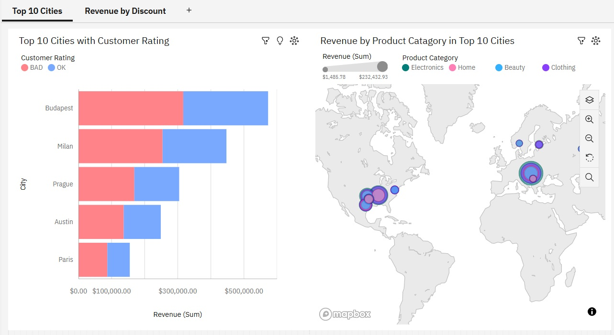
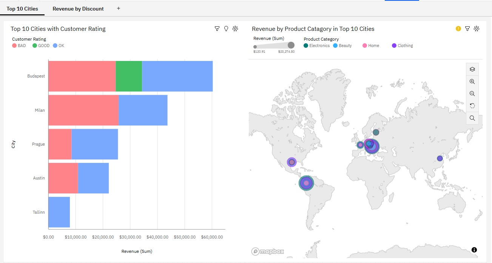
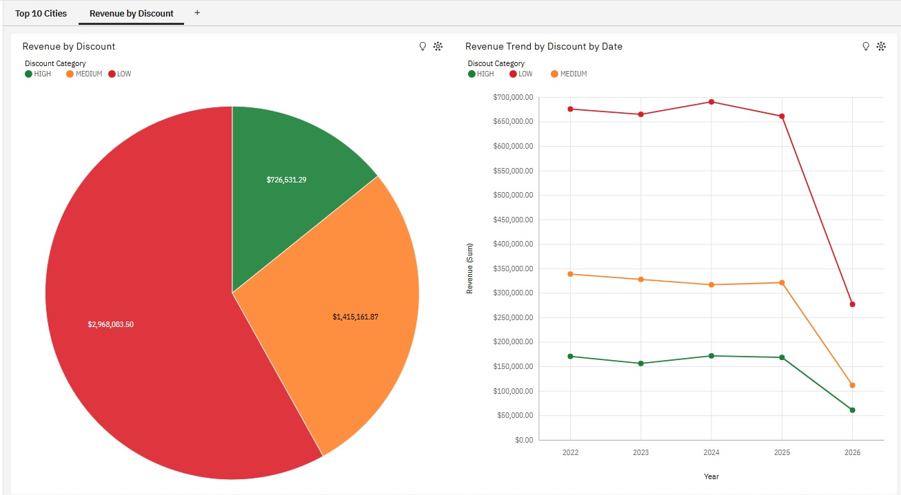
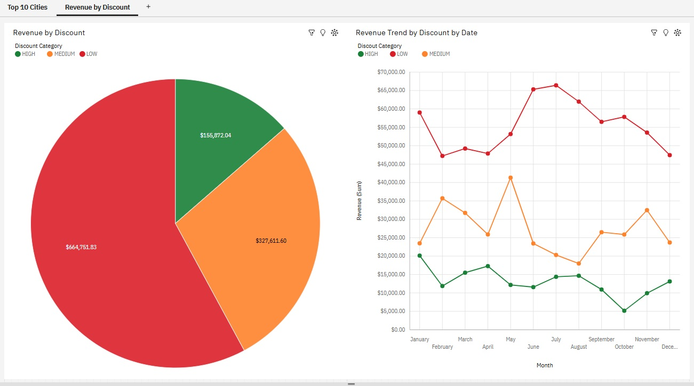
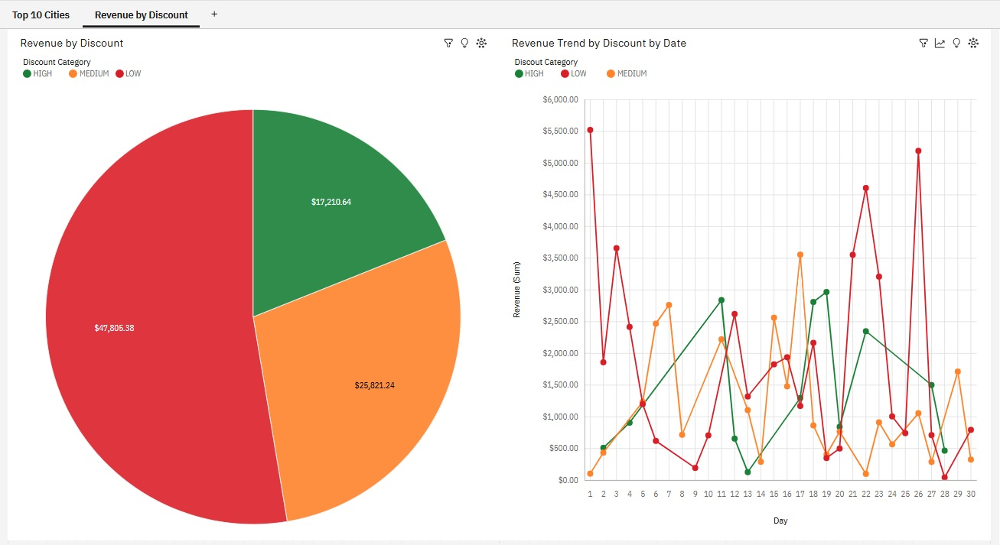

# Interactive E-commerce BI Dashboard (IBM Cognos Analytics)

## Project Overview
This pet project focuses on an end-to-end data analysis of an e-commerce platform's regional sales and marketing discount performance. 
The dataset contains 5,000 cleaned transaction records spanning from 2022 to 2026, linked with a database of 1,000 unique customers.

The goal of the project was to build a highly interactive dashboard to monitor regional revenue, analyze the effectiveness of marketing discount strategies, and uncover any significant revenue changes.

---

## Key Business Insights (Executive Summary)
1. **Discount Optimization:** The vast majority of total revenue (**$2.9M+**) is generated by orders with minimal discounts (`LOW`). This indicates strong product-market fit and customer loyalty, proving that the business does not heavily depend on aggressive price-cutting to drive sales.
2. **2026 Revenue Anomaly:** A drastic revenue drop-off was identified across all discount tiers in 2026. Leveraging the drill-down feature, this was determined to be a systematic pattern rather than a random monthly fluctuation, highlighting the need for deeper investigation into 2026 supply chain or localized marketing disruptions.
3. **Regional Hubs:** Budapest, Milan, and Prague were uncovered as the absolute top-performing regional hubs across almost all product categories. Supply chain and warehouse scaling should be prioritized in these regional hubs.

---

## Technical Workflow
* **Data Sources:** 5,000 cleaned transaction records + 1,000 customer database.
* **Data Modeling (Data Module):** Performed a `Left Outer Join` between tables using `customer_id` as the key. Optimized data architecture by changing the `customer_id` usage type from `Measure` to `Identifier`.
* **Data Enrichment:** Created custom calculated columns (`Year_Order_Date`, `Month_Order_Date`) using built-in Cognos functions. Transformed numeric month values into month names using a conditional `CASE` statement to improve dashboard readability.
* **Advanced Navigation:** Configured a custom `Navigation Path` to enable a seamless three-level time drill-down feature (**Year -> Month -> Day**).
* **Geographical Analysis:** Implemented an interactive geospatial map utilizing the `Point` layer, mapping revenue to **Point Size** and product categories to **Color**.

---

## Dashboards Preview
### 1. Regional Sales & Performance
* *The left chart displays the Top 10 Cities by total revenue, cross-referenced with customer satisfaction ratings (`GOOD` / `BAD` / `OK`).*
* *The right chart features an interactive map displaying the Top 10 Cities by revenue, broken down by product category penetration.*

### 2. Discount Efficiency & Revenue Trends
* *The Donut/Pie chart illustrates revenue distribution across 3 custom discount tiers (LOW, MEDIUM, HIGH).*
* *The Line chart captures chronological revenue trends by discount category, supporting deep-dive analysis via time drill-down (Year -> Month -> Day).*

## Skills Demonstrated
* **Advanced BI Visualization:** Configuring interactive geospatial point layers, establishing dynamic cross-widget filtering, and engineering custom `Navigation Paths` for multi-level hierarchical drill-downs.
* **Analytical Mindset & Root-Cause Analysis:** Executing deep-dive trend investigations, isolating chronological business anomalies (such as the 2026 revenue drop), and converting complex data patterns into actionable strategic advice for stakeholders.

---
*This project was developed as a part of the IBM Data Analyst Professional Certificate on Coursera.*

## 🤖 AI Collaboration
---
*This project was developed in active collaboration with an AI assistant. AI was utilized as a technical co-pilot to research optimized workarounds for IBM Cognos Analitycs (for instance, a cinditional `CASE` statement), polish business metrics terminology, and refine documentation structure.*
